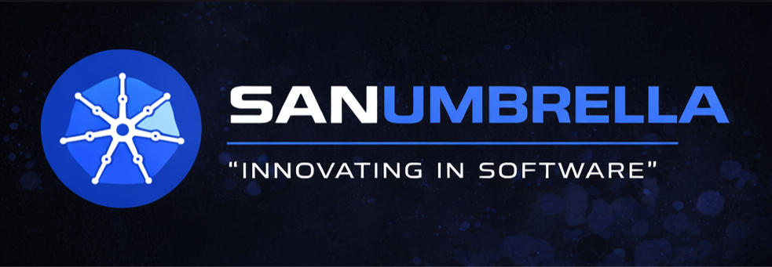
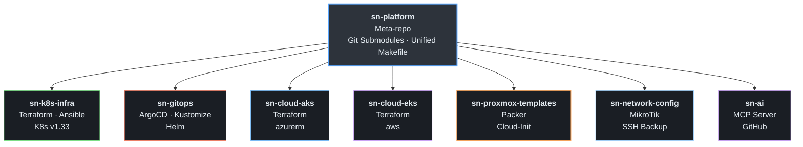
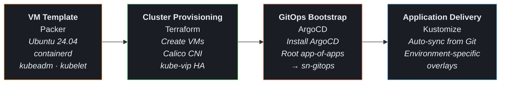
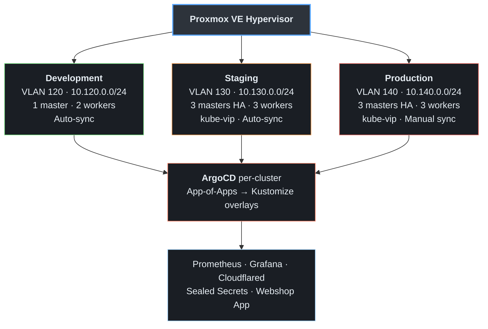
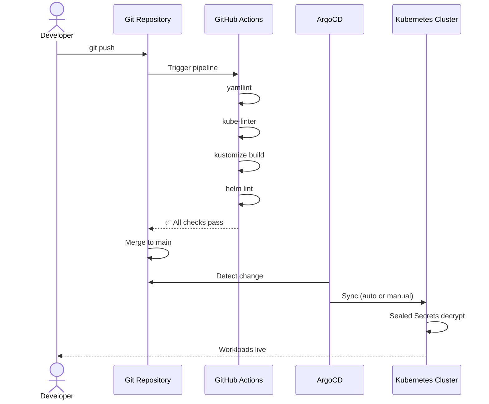

<p align="center">
  
</p>

# SNprogSN Platform
## Multi-Cloud Internal Developer Platform

> Production-grade Kubernetes platform spanning on-premises (Proxmox), Azure (AKS), and AWS (EKS) — fully automated with Infrastructure as Code, GitOps, and CI/CD pipelines.

<table align="center">
  <tr>
    <td align="center"><a href="#infrastructure-as-code"></a></td>
    <td align="center"><a href="#gitops-delivery-model"></a></td>
  </tr>
  <tr>
    <td align="center"><a href="#technology-stack"></a></td>
    <td align="center"><a href="#platform--orchestration"></a></td>
  </tr>
  <tr>
    <td align="center"><a href="#cicd-pipeline-overview"></a></td>
    <td align="center"><a href="#platform-engineering-highlights"></a></td>
  </tr>
</table>

---

## About This Repository

This is a **portfolio showcase** of a production Internal Developer Platform (IDP) I designed and built. The platform source code lives across 7 private repositories (linked below). This repo documents the architecture, design decisions, and engineering practices behind the system.

> **Interested in the source code?** I'm happy to walk through the implementation in detail or provide access upon request.

---

## Overview

This project is a **self-built Internal Developer Platform (IDP)** designed to manage the full lifecycle of Kubernetes workloads across three infrastructure providers. It reflects real-world enterprise patterns: environment isolation, automated provisioning, GitOps-driven deployments, secret management, and comprehensive observability.

**Key design principle:** Developers push code → the platform handles everything else.

### What This Platform Does

| Capability | Implementation |
|---|---|
| **Multi-cluster provisioning** | Terraform modules create identical clusters across Proxmox, AKS, and EKS |
| **Automated configuration** | Ansible roles handle OS prep, K8s bootstrap, CNI, HA, and post-install |
| **GitOps delivery** | ArgoCD syncs manifests from Git — auto-sync for dev/staging, manual approval for production |
| **Secret management** | Sealed Secrets encrypt at rest; secrets never exist in Git |
| **Observability** | Prometheus + Grafana deployed per-cluster via Kustomize overlays |
| **Secure ingress** | Cloudflare Tunnel for zero-trust external access (no public IPs exposed) |
| **Network automation** | MikroTik router/switch configs versioned in Git with scheduled backups |
| **VM template pipeline** | Packer builds K8s-ready VM templates on Proxmox automatically |
| **Developer onboarding** | Dev Containers, one-command bootstrap, unified Makefile with 88 targets |

---

## Architecture



### End-to-End Deployment Flow



### Multi-Environment Architecture (On-Premises)



### GitOps Delivery Model



---

## Technology Stack

### Platform & Orchestration

| Technology | Version | Purpose |
|---|---|---|
| Kubernetes | v1.33.9 | Container orchestration |
| ArgoCD | v2.14.4 | GitOps continuous delivery |
| Calico | v3.28.1 | CNI networking (VXLAN) |
| kube-vip | v0.8.7 | Control plane HA (VIP) |
| Sealed Secrets | v0.27.3 | GitOps-compatible secret encryption |
| Cloudflare Tunnel | 2024.12.2 | Zero-trust ingress (no public IP) |

&nbsp;

### Infrastructure as Code

| Technology | Purpose |
|---|---|
| Terraform (Proxmox provider) | On-prem VM provisioning |
| Terraform (azurerm ~> 4.0) | Azure AKS clusters |
| Terraform (aws ~> 5.0) | AWS EKS clusters |
| Ansible (23 roles) | Configuration management & K8s bootstrap |
| Packer | Immutable VM template builds |

&nbsp;

### Observability

| Technology | Purpose |
|---|---|
| Prometheus | Metrics collection with persistent storage |
| Grafana | Dashboards & visualization |

&nbsp;

### CI/CD & Automation

| Technology | Purpose |
|---|---|
| GitHub Actions (14 workflows) | Lint, validate, plan, apply, build |
| Makefile (88 targets) | Unified developer interface |
| Dev Containers | Reproducible development environment |
| ShellCheck + yamllint + kube-linter | Shift-left quality gates |

&nbsp;

### Networking

| Technology | Purpose |
|---|---|
| MikroTik RB5009 | Router — VLAN, firewall, DHCP |
| MikroTik CRS310 | Managed switch — VLAN trunk |
| Cloudflare | DNS, tunneling, zero-trust access |

---

## Repository Structure

The platform is organized as a multi-repo architecture connected via Git submodules:

| Repository | Description | Key Technologies |
|---|---|---|
| **sn-platform** | Meta-repo — unified entry point with Makefile, bootstrap, docs | Git submodules, Make |
| **sn-k8s-infra** | On-prem K8s cluster provisioning (3 environments) | Terraform, Ansible, Proxmox |
| **sn-gitops** | GitOps manifests for all clusters | ArgoCD, Kustomize, Helm |
| **sn-cloud-aks** | Azure AKS infrastructure | Terraform (azurerm) |
| **sn-cloud-eks** | AWS EKS infrastructure | Terraform (aws) |
| **sn-proxmox-templates** | Immutable VM template pipeline | Packer, Cloud-Init |
| **sn-network-config** | Network device config versioning | MikroTik, SSH, Bash |
| **sn-ai** | AI tooling — MCP server for GitHub | Docker, Python |

> Source repositories are private. Access can be provided upon request for code review.

---

## Platform Engineering Highlights

### 1. Self-Service Infrastructure

A single `make deploy-dev` command provisions an entire Kubernetes environment end-to-end:

```
Packer template → Terraform VMs → Ansible bootstrap → ArgoCD installed → Apps synced
```

No manual steps. No SSH. No kubectl apply. The platform handles it.

### 2. Multi-Cloud with Unified GitOps

All three infrastructure types (Proxmox on-prem, Azure AKS, AWS EKS) converge on the same GitOps repository. A single `sn-gitops` repo serves all clusters through Kustomize overlays:

```
base/                    ← shared manifests (write once)
overlays/
  on-prem/dev/           ← on-prem development patches
  on-prem/staging/       ← on-prem staging patches  
  on-prem/production/    ← on-prem production patches
  aks/dev/               ← Azure dev patches
  aks/prod/              ← Azure prod patches
  eks/dev/               ← AWS dev patches
  eks/prod/              ← AWS prod patches
```

### 3. Environment Promotion with Safety Gates

| Environment | Sync Policy | Rationale |
|---|---|---|
| Development | Auto-sync + self-heal | Fast iteration, no approval needed |
| Staging | Auto-sync + self-heal | Validate before production |
| Production | **Manual sync only** | Human approval required for every change |

### 4. Immutable Infrastructure Pipeline

```
Ubuntu cloud image → Packer provisions → containerd + kubeadm installed
    → machine-id reset → cloud-init cleaned → Template VM created
        → Terraform clones template → Cloud-Init injects SSH keys → Ready
```

VMs are never patched in place. New template → new VMs → old ones destroyed.

### 5. Secret Management (Zero Secrets in Git)

Three-layer model ensuring no credentials ever touch version control:

| Layer | Content | Storage |
|---|---|---|
| Configuration | Non-secret values, examples | Git (tracked) |
| Secrets | API tokens, passwords, cloud credentials | `~/.config/` or GitHub Secrets |
| Cluster Secrets | Application secrets | Sealed Secrets (encrypted in Git) |

### 6. Production-Grade HA

- **Control plane**: 3-node HA with kube-vip (ARP mode VIP) for staging + production
- **etcd**: Local NVMe storage for performance
- **Boot ordering**: Sequential cluster startup (dev → staging → prod) on Proxmox reboot
- **NUMA pinning**: Optional CPU/memory affinity for predictable performance

### 7. Network as Code

MikroTik router and switch configurations are versioned in Git with:
- Weekly automated backups via GitHub Actions (self-hosted runner)
- PR-based config review with automatic diff comments
- VLAN segmentation (120/130/140) for environment isolation

### 8. Developer Experience

- **Dev Containers**: All tools pre-installed (Terraform, Ansible, kubectl, Helm, kubeseal)
- **Unified Makefile**: 88 targets covering every operation
- **One-command bootstrap**: `./scripts/bootstrap.sh` sets up the entire workspace
- **Kubeconfig switching**: `./switch-kube.sh dev|staging|production`
- **Interactive onboarding**: `make setup-secrets` guides through credential setup

---

## CI/CD Pipeline Overview

Every repository has automated quality gates:

| Repository | Workflows | What Gets Validated |
|---|---|---|
| sn-k8s-infra | `validate.yml` | Terraform validate (3-env matrix), ansible-lint, shellcheck |
| sn-gitops | `lint.yml` | yamllint, kube-linter, kustomize build (14 combinations), helm lint |
| sn-cloud-aks | `plan.yml` / `apply.yml` | Terraform plan on PR, apply on merge (prod requires approval) |
| sn-cloud-eks | `plan.yml` / `apply.yml` | Terraform plan on PR, apply on merge (prod requires approval) |
| sn-proxmox-templates | `validate.yml` / `build.yml` | Packer fmt + validate on PR, build on merge (self-hosted) |
| sn-network-config | `backup.yml` / `diff.yml` | Weekly scheduled backup, config diff on PR |

**Production safety**: Cloud deployments to production environments require manual approval through GitHub Environment protection rules.

---

## Architecture Decisions

Key decisions are documented as Architecture Decision Records (ADRs):

| ADR | Decision | Rationale |
|---|---|---|
| ADR-0001 | Multi-repo structure | Blast radius isolation, independent CI/CD, separated access |
| ADR-0004 | Sealed Secrets | Cluster-specific encryption, GitOps-compatible |
| ADR-0008 | Dev Containers | Reproducible environments, zero local tool installation |
| ADR-0009 | GitHub Actions | Shift-left testing, lint/validate before merge |
| ADR-0011 | Dedicated cloud repos | Independent lifecycle for AKS/EKS, different Terraform providers |

---

## By the Numbers

| Metric | Value |
|---|---|
| Kubernetes environments | 3 (dev, staging, production) |
| Infrastructure providers | 3 (Proxmox, Azure, AWS) |
| Total VMs managed | 19 across 3 on-prem clusters |
| Ansible roles | 23 with 250+ tasks |
| Ansible playbooks | 13 for full lifecycle management |
| CI/CD workflows | 14 across 7 repositories |
| Makefile targets | 88 unified commands |
| Kustomize overlays | 14 cluster/env/app combinations |
| Applications deployed | Prometheus, Grafana, Cloudflare Tunnel, Sealed Secrets, ArgoCD, Webshop |
| Infrastructure as Code | 100% — nothing is manually provisioned |
| GitOps managed | 100% — all deployments flow through Git |

---

## Project Motivation

This platform was built to solve a real problem: managing multiple Kubernetes environments across hybrid infrastructure without manual intervention. Every component — from VM templates to application delivery — follows the principle that **infrastructure should be declarative, version-controlled, and self-healing**.

The goal is not just to run containers, but to provide a **platform that other developers can use** to deploy their applications safely and efficiently, with built-in guardrails for security, observability, and environment promotion.

---

<p align="center">
  <b>Built with platform engineering principles: automate everything, version everything, trust nothing manually.</b>
</p>
